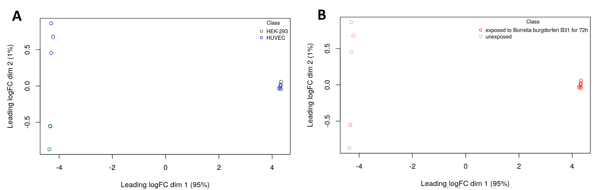

# Introduction
Previously in Assignment 1, the RNA-seq dataset with accession [GSE194294](https://www.ncbi.nlm.nih.gov/geo/query/acc.cgi?acc=GSE194294), referred to as the **Bb RNAseq dataset** moving forward, was explored, pre-processed, and normalized in preparation for differential expression (DE) analysis which will be performed in this assignment.

## Dataset Summary
In brief, the Bb RNAseq dataset investigates how exposure to _Borrelia burgdorferi_, the bacterium responsible for Lyme disease, affects gene expression and DNA methylation in human cells [@berthold2024]. The experimental design used to obtain this dataset consisted of 12 samples that had one control and one condition for each cell line with three replicates each. The cell lines were HUVEC (human umbilical vein endothelial cells) and HEK-931 (human embryonic kidney cells) with the control being these cells incubated in pure growth medium while the condition was growing these cells with _B. burgdorefri strain B31_ fror about a 72 hour exposure.

## Data Cleanup and Filtering
The raw counts matrix of the dataset containing information on both cell lines was obtained which upon exploration, included 29350 cells and 12 samples as mentioned above. Before pre-processing, the initial distributions of the dataset was visualized using boxplots and density plots where it is seen that the distribution shape is similar across all samples but similar cell lines cluster with each other. Filtering of lowly expressed genes was then applied, making sure to keep genes that are present in at least 2 samples to ensure that the genes kept are found in the majority of the replicates per condition. After filtering, there were 16620 genes left compared to the initial number which was 29530. The distribution was then examined again and showed that majority of the lowly expressed genes have been filtered, with some being retained due to possible biological variability.

## Normalization {#normalization}
After pre-processing the dataset, it underwent normalization through TMM (Trimmed Mean of M-values) using the *edgeR* [@chen2024] package. This normalization method was chosen because it accounts for library size differences without forcing distributions to be identical i.e. it normalizes RNA-seq data while preserving meaningful biological variation which is what we want for the DE analysis. Once the normalization has been applied to the dataset, the density plot shows the distribution being smoothed out across all samples, indicating that the distributions have tightened and making the samples more comparable against each other. The boxplots, on the other hand, show that the median for all samples were lined up in the median line. Additionally, the normalized dataset was assessed for outliers, saaple separation by MDS, and dispersion through a BCV plot. No outliers were excluded from the normalized dataset akin to the original publication methods. MDS plot based on treatment (_B. burgdorferi exposure_ vs. unexposed) shows better separation of conditions wherein similar treatments cluster together. This observation suggests that treatment effect is more dominant that cell type effects which indicate that the cell lines may have to be analyzed separately in downstream analysis. Lastly, the normalized dataset was confirmed to be following a negative-binomial model, concluding that NB model assumptions hold for high-expression genes.

## Identifier Mapping
In this final step processing the dataset, Ensemble IDs were converted to HGNC symbols via the package *biomaRt* [@durinck2009]. After mapping 164797 genes were mapped which is around 99.25% of the total genes after normalization. The unmapped genes were omitted since there were only a few while mapppings were further processed in order to address duplicate expression values for certain genes or different genes having the same HGNC symbol.

## Final Normalized Dataset
After all the pre-processing performed in the initial dataset, the final normalized matrix had 16497 mapped genes with an overall coverage of 1.2 million counts for the HUVEC samples while 800k counts for the HEK293 samples.

# Load Libraries Used
In this report, xxx libraries were used for the different downstream analysis performed:

1. **knitr** [@xie2014] to format tables in html using `kable`
2. **edgeR** [@chen2024] to perform DE analysis
2. ** ** [@]


```{r, warning=FALSE, message=FALSE}
library(edgeR)
library(knitr)
library(ComplexHeatmap)
library(circlize)
library(ggplot2)
library(gridExtra)
library(gprofiler2)
```


# Differential Expression
In this section, we obtain the differentially expressed genes between cell lines that are exposed to _B. burgdorferi_ versus those that are unexposed to the bacteria.

## Revisit MDS Plot
Before performing differential expression, we revisit the MDS plots obtained in Assignment 1. As mentioned in the [Introduction](#normalization), the MDS plot based on treatment (Fig. 1A) shows better separation of conditions than the MDS plot based on cell types (Fig. 1B).



**Figure 1: MDS Plots of the normalized GSE194294 dataset.** [A] Plot based on cell line. [B] Plot based on treatment. [A, B] X-axis represents 95% of the variance in the samples while the y-axis represents 1% of the variance.

Fig. 1B shows that classifying by cell lines do not explain majority of the variance in the data whereas Fig. 1A shows shows better separation of conditions where the controls cluster on the left while those that were exposed to B. burgdorferi cluster on the right at. It is interesting to note however that there is still separation among the controls, which can be explained by the difference in cell line. 

Due to the observed dominant effect of the treatment as compared to the cell lines, I decided to analyze the cell lines separately as the authors did in the original publication. Therefore, the differential expression analysis as well as other downstream analysis for this dataset will be conducted separately between the HUVEC and HEK-293 cell lines 

## Model Design {#model-design}
This dataset is simple and does not have many groups. Although below we find three rows (that are not the title), _cell line_ and _cell type_ actually refer to the same thing. Thus, this dataset only has two groups or factors: `cell line` and `treatment`.

**Table 1. Sample types for the Bb RNAseq Dataset**
```{r}
# Load the sample types dataframe from Assignment 1
load("RDataFromA1/sample_types.RData")
kable(t(sample_types[1, ]))
```

We start of by creating a simple model, which given the factors above, will create a matrix that represents our model. From the MDS plot, we know that treatment has a dominant effect and as previously mentioned, we separate the data by cell line so this leaves us with only `treatment` as the factor we can input to the model.

```{r}
# Separate samples by cell line
hek293_samples <- sample_types[1:6, ]
huvec_samples <- sample_types[7:12, ]

# Create model design for each cell line 
hek293_model_design <- model.matrix(~hek293_samples$treatment)
huvec_model_design <- model.matrix(~huvec_samples$treatment)
```

**Table 2A. HEK293 Model Design Matrix**
```{r}
kable(hek293_model_design, row.names = TRUE)
```
**Table 2B. HUVEC Model Design Matrix**
```{r}
kable(huvec_model_design, row.names = TRUE)
```

We observe from that the two model design tables (Table 2AB) for the two cell lines are similar because they are both formatted the same way. Each cell has six samples with three replicates for each condition. The first three samples in both cell lines correspond to controls (as denoted by 1 in the `_$treatmentunexposed` column) while the last three correspond to those that were exposed to _B. burgdorferi_. These models will be used in the following section when fitting the model.  

## Fitting the Model
Before fitting the model, we subset the normalized data matrix so that we separate by cell lines.
```{r}
# Load the filtered matrix from A1 (Before Identifier Mapping)
load("RDataFromA1/filtered_data_matrix.RData")

# Rearrange columns so controls come first before treatment
hek293_matrix <- filtered_data_matrix[, c(10:12, 4:6)]
huvec_matrix <- filtered_data_matrix[, c(7:9, 1:3)]

# Remove version numbers in gene ids for mapping later
rownames(hek293_matrix) <- unlist(lapply(rownames(hek293_matrix), 
                                         FUN=function(x){unlist(strsplit(x, split = "\\."))[1]}))
rownames(huvec_matrix) <- unlist(lapply(rownames(huvec_matrix), 
                                         FUN=function(x){unlist(strsplit(x, split = "\\."))[1]}))
```

The _edgeR_ [@chen2024] package contains many different models that can be used for differential expression. In this report, we used the **Quasi Likelihood (QL) Test** (`glmQLFTest`) which is highly recommended for bulk RNASeq experiments. Although the exactTest would be an appropriate method to use because the Bb RNAseq dataset uses a model with only one factor, the Quasi Likelihood test is generally more preferable because it estimates variance better, is more robust to DE analysis, and controls for FDR better, reducing the number of false positives [@chen2024].

### Multiple Hypothesis Testing
By default, the glmQLFTest uses the Benjamini-Hochberg (BH) method for multiple hypothesis testing. The BH correction controls for the false discovery rate (FDR), making it well suited for RNA-seq data where thousands of genes are tested simultaneously [@korthauer2019]. Another method used in multiple hypothesis testing is the Bonferroni correction method. However, it is more stringent and highly conservative which greatly reduces the power to detect true positives. As such, BH correction was chosen as the method for multiple hypothesis testing in our analysis of finiding DE genes.

### HEK293 QL Fitting and Testing
The coefficent for the QLF test is specified as `hek293_samples$treatmentunexposed` which is the second column in the model design matrix after `(Intercept)` ([Table 2A](#model-design)). By setting this as the coefficient, we are looking at the differential expression between unexposed (control) and treatment (_B. burgdorferi_ exposure).

**Table 3A. Top 10 Differentially Expressed Genes in HEK293**
```{r}
# Create an edgeR container
hek293_container <- DGEList(counts = hek293_matrix, group = hek293_samples$treatment)

# Normalize dataset
hek293_container <- calcNormFactors(hek293_container)

# Estimate dispersion
hek293_container <- estimateDisp(hek293_container, hek293_model_design)

# Fit to model
hek293_fit <- glmQLFit(hek293_container, hek293_model_design)

# Calculate DE using Quasi Likelihood model
qlf_hek293 <- glmQLFTest(hek293_fit, coef = "hek293_samples$treatmentunexposed")

kable(topTags(qlf_hek293), digits = 15)
```

Using the `topTags()` fucntion, we were able to see the top 10 differentially expressed genes from the HEK293 cell line. After BH, we see that the corrected p-values are already significant showing as low as e-15. Notice also, that the logFC are all positive, meaning that these 10 genes are more highly expressed in the controls.

### HUVEC QL Fitting and Testing
Similarly, we apply the same method to the HUVEC cell line. The coefficient is set to `huvec_samples$treatmentunexposed` ([Table 2B](#model-design)).

**Table 3B. Top 10 Differentially Expressed Genes in HUVEC**
```{r}
# Create an edgeR container
huvec_container <- DGEList(counts = huvec_matrix, group = huvec_samples$treatment)

# Normalize dataset
huvec_container <- calcNormFactors(huvec_container)

# Estimate dispersion
huvec_container <- estimateDisp(huvec_container, huvec_model_design)

# Fit to model
huvec_fit <- glmQLFit(huvec_container, huvec_model_design)

# Calculate DE using Quasi Likelihood model
qlf_huvec <- glmQLFTest(huvec_fit, coef = "huvec_samples$treatmentunexposed")

kable(topTags(qlf_huvec), digits = 15)
```

After BH, we see that the corrected p-values are already significant showing as low as e-12 which are a bit higher than in HEK293. Notie also, that the logFC are all negative (opposite direction as observed in HEK293), meaning that these 10 genes are more highly expressed in the treatment.

## Significant Differentially Expressed Genes. 

### Thresholds
P-values were considered at a threshold of 0.05 to initially assess statistical significance while a significance threshold of FDR < 0.05 was used to identify DE genes. The FDR-adjusted values were prioritized rather than p-values because they account for multiple hypothesis testing. The threshold of 0.05 was chosen for both metrics because it is widely accepted in RNA-seq studies. This threshold effectively controls the false discovery rate by ensuring that on average, 5% of identified DE genes are false positive [@mccarthy2009]. 


```{r}
# Top hits in HEK293
qlf_hits_hek293 <- topTags(qlf_hek293,
                           sort.by = "PValue",
                           n = nrow(hek293_matrix))

# Count DE Genes in HEK293 passing thresholds
hek293_pval <- length(which(qlf_hits_hek293$table$PValue < 0.05))
hek293_fdr <- length(which(qlf_hits_hek293$table$FDR < 0.05))

# Top hits in HUVEC
qlf_hits_huvec <- topTags(qlf_huvec,
                           sort.by = "PValue",
                           n = nrow(huvec_matrix))

# Count DE Genes in HUVEC passing thresholds
huvec_pval <- length(which(qlf_hits_huvec$table$PValue < 0.05))
huvec_fdr <- length(which(qlf_hits_huvec$table$FDR < 0.05))
```

Using the threshold of p-value <0.05, **`r hek293_pval`** genes in HEK293 remain significant while *** `r huvec_pval`** genes are retained in HUVEC. After correction with FDR < 0.05, both cells show drastic reduction: **`r hek293_fdr`** (`r  round(hek293_fdr/hek293_pval, 2)`%) for HEK293 and **`r huvec_fdr`** (`r round(huvec_fdr/huvec_pval, 2)`%) for HUVEC which is expected to occur in multiple hypothesis testing. From this result, we observe that HUVEC retained more DE genes after FDR correction which may indicate a stronger treatment effect or more consistent gene expression changes across the replicates. Additionally, this observation could imply that there are biological differences in how each cell line respond to the treatment.


### MA Plot
The MA plot provides an overview of the overall distribution of gene expression changes which helps us in visually inspecting the spread of log-fold changes against the average expression level. We create this plot first as it highlights the general trend in our dataset and shows the biologically relevant DE genes.

```{r}
# Create the MA plot function based on the plotMD function from edgeR
createMAplot <- function(qlf_hits, title) {
  plotMD(qlf_hits,
         main = title,
         xlab = "Average log CPM", 
         ylab = "log Fold Change")
  abline(h=c(-1, 1), col="green")
}

# Do the plots side by side
par(mfrow = c(1, 2))

# Create MA plots
createMAplot(qlf_hek293, "A. HEK293")
createMAplot(qlf_huvec, "B. HUVEC")

# Return plotting to normal
par(mfrow = c(1, 1))
```

**Figure 2. MA plot showing differential expression for the Bb dataset comparing treatment vs. control.** [A] HEK293 cells. [B] HUVEC cells. Significant DE genes are determined from a threshold of FDR < 0.05 and colored red if upregulated and blue if downregulated. Genes that are not significant are colored black. The blue lines represent log fold changes of ±1, highlighting biologically relevant changes in gene expression.

From Fig. 2, we observe a noticeable difference in the general trends of both cell lines. HEK293 exhibits a greater proportion of DE genes that are upregulated, whereas HUVEC predominantly shows downregulated genes. Although there are many genes that are statistically significant in both cell lines, most of these do not meet the threshold for biological significance, i.e., they do not have log fold changes above the ±1 cutoff, suggesting that while these genes may be influenced by treatment or condition, the magnitude of their change may not be biologically relevant.

A key distinction is that HUVEC shows a significantly higher number of genes that are both statistically significant and biologically relevant (log fold change > ±1) compared to HEK293, indicating that HUVEC's response to treatment may involve a more pronounced biological effect. This may suggest a stronger or more consistent gene expression alteration in response to the experimental condition in HUVEC.

### Volcano Plot

Similar to the MA plot, the volcano plot allows for easy identification of genes that are both statistically significant and have a large fold change. The main difference between the teo is that in the MA plot, we do not highlight the genes that are statistically signigicant but have a log fold change that is below the threshold of±1 .

```{r}
createVolcano <- function(qlf_hits, title){
  qlfTable <- qlf_hits$table
  qlfTable$topDE <- "NA"
  
  qlfTable$topDE[qlfTable$logFC > 1 & qlfTable$FDR < 0.05] <- "Up"
  qlfTable$topDE[qlfTable$logFC < -1 & qlfTable$FDR < 0.05] <- "Down"

  ggplot(data=qlfTable, aes(x=logFC, y=-log10(FDR), color = topDE)) +
    geom_point(aes(size = ifelse(topDE == "NA", 0.5, 2))) +
    theme_minimal() +
    scale_colour_discrete(type = c("blue", "black", "red"), breaks = c("Up", "Down")) +
    scale_size_continuous(range = c(0.5, 2), guide="none") +
    labs(title = title, x = "log Fold Change", y = "-log10(FDR)")
}

# Create Volcano plots
hek293_volcPlot <- createVolcano(qlf_hits_hek293, "A. HEK293")
huvec_volcPlot <- createVolcano(qlf_hits_huvec, "B. HUVEC")

# Do the plots side by side
grid.arrange(hek293_volcPlot, huvec_volcPlot, ncol = 2)
```

**Figure 3. Volcano plot of differential gene expression between control and treatments in the Bb dataset.** [A] HEK293 cells. [B] HUVEC cells. Significant DE genes are determined from a threshold of FDR < 0.05 and a log fold change of ±1. Genes are colored red if upregulated and blue if downregulated. Genes that are not significant are colored black.

From Fig. 3, we further explore the relationship between the magnitude of gene expression changes (lo2 fold change) and their statistical significance (FDR) for both HEK293 and HUVEC cell lines. The volcano plot clearly highlights genes with both large log fold changes and significant FDR values.

In HEK293, only a small subset of statistically significant genes surpass the biological significance threshold of ±1 log fold change, as indicated by the lack of substantial DE genes compared to HUVEC. In contrast, HUVEC shows a more prominent clustering of genes with both high significance and large fold changes, reinforcing the earlier observation from the MA plot that HUVEC has a more robust biological response to treatment, with more genes exhibiting biologically relevant changes in expression. Of note, most of the DE genes in HUVEC are downregulated whereas HEK293 is prominently upregulated.

This volcano plot complements the MA plot by providing a more direct visualization of how both significance and biological relevance are distributed across the Bb dataset, underscoring the cell line specific response to the experimental condition _B. burgdorferi_ exposure.

### Heatmaps

Compared to the previous plots, a heatmap is a more detailed visualization which displays the expression of top DE genes across the samples. With this information, we can observe patterns in both gene and sample clustering which can help us confirm the biological significance of our findiungs on DE genes.

* Note that we also use the normalized counts matrix of the Bb dataset when generating the heatmaps, whereas the previous plots did not use this matrix. The difference in this matrix is that it has been transformed to counts per million.
```{r}
# Col 1 is the ensembl_gene_id and col 2 is the hgnc_symbol
load("RDataFromA1/normalized_counts_annot.RData")

# HEK293
hmap_matrix_hek293 <- normalized_counts_annot[, c(12:14, 6:8)]
rownames(hmap_matrix_hek293) <- normalized_counts_annot[, 1]

top_hits_hek293 <- rownames(qlf_hits_hek293$table)[
  qlf_hits_hek293$table$PValue<0.05]

hmap_tophits_hek293 <- t(scale(t(hmap_matrix_hek293[
  which(rownames(hmap_matrix_hek293) %in% top_hits_hek293),])))

# HUVEC
hmap_matrix_huvec <- normalized_counts_annot[, c(9:11, 3:5)]
rownames(hmap_matrix_huvec) <- normalized_counts_annot[, 1]

top_hits_huvec <- rownames(qlf_hits_huvec$table)[
  qlf_hits_huvec$table$PValue<0.05]

hmap_tophits_huvec <- t(scale(t(hmap_matrix_huvec[
  which(rownames(hmap_matrix_huvec) %in% top_hits_huvec),])))

```

* To make the heatmap more understandable, we also add annotations on which treatments the samples belongs. 
* Note that this is the only factor left for our samples because we already separated them by cell lines.

```{r}
createHeatmap <- function(hmap_tophits, title){
  if(min(hmap_tophits) == 0){
    heatmap_col = colorRamp2(c( 0, max(hmap_tophits)),c( "white", "red"))
    } else {
      heatmap_col = colorRamp2(c(min(hmap_tophits), 0, 
                                 max(hmap_tophits)), c("blue", "white", "red"))
      }
  hmap_annot <- HeatmapAnnotation(Treatment = factor(c(rep("Control", 3),
                                                       rep("Bb exposure", 3))),     
                                  col = list(Treatment = c("Control" = "green", 
                                                           "Bb exposure" = "yellow")))
  
  current_heatmap <- Heatmap(as.matrix(hmap_tophits),
                             cluster_rows = TRUE,
                             cluster_columns = TRUE,
                             show_row_dend = TRUE,
                             show_column_dend = TRUE,
                             col=heatmap_col,
                             show_column_names = FALSE,
                             show_row_names = FALSE,
                             show_heatmap_legend = TRUE,
                             top_annotation = hmap_annot,
                             column_title = title)
  
  return(current_heatmap)
}
```

```{r, fig.align = "center"}
# Create heatmaps
hek293_hmap <- grid.grabExpr(
  print(createHeatmap(hmap_tophits_hek293, title = "A. HEK293")))
huvec_hmap <- grid.grabExpr(
  print(createHeatmap(hmap_tophits_huvec, title = "B. HUVEC")))

# Do the plots side by side
grid.arrange(hek293_hmap, huvec_hmap, ncol = 2)

```

**Figure 4. Heatmap of differentially expressed genes in the Bb dataset clustered by genes and samples.** [A] HEK293 cells. [B] HUVEC Cells. [A, B] The color scale ranges from blue to red, representing fold changes from approximately -2 to 2, with blue indicating downregulation and red indicating upregulation. The samples are annotated (control vs. treatment) on top of the sample dendrogram, and genes are clustered with their own dendrogram to reveal patterns of co-expression. Note that the clustering of sammples in [A] is in the reverse order of the clustering in [B].

As evident in the clustering patterns of the columns in Fig. 4, samples cluster together by condition (treatment vs. control) in both cell lines. This observation indicates that within each cell line, gene expression patterns are altered by the experimental condition which in this case is _B. burgdorferi_ exposure. This clustering of samples occur because the treatment induces similar responses across biological replicates while control samples maintain their baseline expression levels.

Similarly, we observe that genes are clustered as we observe distinct regions of upregulation (red) and downregulation (blue) with minimal mixing which indicates that certain groups of genes show coordinated changes in expression, likely due to common regulatory mechanisms or involvement in related pathways. Although the heatmap shows clear expressions patterns, we cannot directly conclude that the same genes are up- or downregulates between HEK293 and HUVEC without further analysis that identifies the specific genes. However, since we do observe that similar clustering appears in both heatmaps, this can indicate that a subset of the genes respond similarly to the treatment across cell types while others may show cell-type specific expression changes.

# Thresholded Over-Representation Analysis
Over-Representation Analysis (ORA) is a statistical approach used to identify gene sets that are significantly enriched in a given gene list. In thresholded ORA, only genes that pass a specific significance threshold are included in the analysis.

## Creating Gene Lists
Before performing ORA, we first create four gene lists: upregulated, downregulated, combined, and bh_corrected. In all of these gene sets, we set a threshold of p-value < 0.05 to establish statistical significance. Additionally, the upregulated gene set will have a log fold change > 1 while the downregulated set will have a log fold change < 1. These thresholds are exactly the same as seen before in the MA and volcano plots. The combined dataset is just a combination of the upregulated and downregulated gene sets while the bh_corrected set will have a threshold of FDR < 0.05 to determine the most significant genes that survive multiple hypothesis testing.

```{r}
# Merge gene names with the top hits
hek293_qlf_hgnc <- merge(normalized_counts_annot[,1:2], qlf_hits_hek293, by.x=1, by.y = 0)
huvec_qlf_hgnc <- merge(normalized_counts_annot[,1:2], qlf_hits_huvec, by.x=1, by.y = 0)

# Upregulated Gene Set
hek293_up_genes <- hek293_qlf_hgnc$hgnc_symbol[which(hek293_qlf_hgnc$PValue < 0.05 & hek293_qlf_hgnc$logFC > 1)]
huvec_up_genes <- huvec_qlf_hgnc$hgnc_symbol[which(huvec_qlf_hgnc$PValue < 0.05 & huvec_qlf_hgnc$logFC > 1)]

# Downregulated Gene Set
hek293_down_genes <- hek293_qlf_hgnc$hgnc_symbol[which(hek293_qlf_hgnc$PValue < 0.05 & hek293_qlf_hgnc$logFC < -1)]
huvec_down_genes <- huvec_qlf_hgnc$hgnc_symbol[which(huvec_qlf_hgnc$PValue < 0.05 & huvec_qlf_hgnc$logFC < -1)]

# Combined Gene Set
hek293_combined <- unique(c(hek293_up_genes, hek293_down_genes))
huvec_combined <- unique(c(huvec_up_genes, huvec_down_genes))

# BH-Corrected Gene Set
hek293_fdr_genes <- hek293_qlf_hgnc$hgnc_symbol[which(hek293_qlf_hgnc$PValue < 0.05 & hek293_qlf_hgnc$FDR < 0.05 & hek293_qlf_hgnc$hgnc_symbol %in% hek293_combined)]
huvec_fdr_genes <- huvec_qlf_hgnc$hgnc_symbol[which(huvec_qlf_hgnc$PValue < 0.05 & huvec_qlf_hgnc$FDR < 0.05 & huvec_qlf_hgnc$hgnc_symbol %in% huvec_combined)]

hek293_up_genes["TGFBI"] <- "TGFB1"
hek293_combined["TGFBI"] <- "TGFB1"
hek293_fdr_genes["TGFBI"] <- "TGFB1"
```

[TODO]

## Running g:Profiler through gprofiler2
To perform ORA, we use **gprofiler2** which is the R implementation of the web-based tool, g:Profiler. This method was chosen because unlike other implemented ORA tools, g:Profiler has regular updates on gene annotations, ensuring that the analysis reflects the most current biological knowledge. Additionally, g:Profiler integrates multiple annotation databases that are able to provide a broad scope for functional insights. Although the web-based version of g:Profiler could have been used for this analysis, the programmatic access provided by gprofiler2 makes it easier for us to integrate it in our workflow as everything else we have conducted has been performed in R.

```{r}
performORA <- function(query_set){
  gprofiler_results <- gost(query = query_set ,
                          significant = TRUE,
                          ordered_query = FALSE,  # query not ordered by significance
                          exclude_iea=TRUE,
                          correction_method = "fdr",
                          organism = "hsapiens",
                          evcodes = TRUE,
                          source = c("REAC", "GO:BP"))
  
  enrichment_results <- gprofiler_results$result
  
  return(enrichment_results)
}
```


## Selected Annotation Databases
Since the Bb dataset aims to analyze _B. burgdorferi_ exposure to human cells, we selected databases that capture immune response, signalling pathways, and cellular processes relevant to host-pathogen interactions. 

```{r}
versions <- get_version_info(organism = "hsapiens")
versions$sources$`GO:BP`
versions$sources$`REAC`
```


* **GO Biological Process** (BioMart release, 2024-10-27) - focuses on functional processes like immune response and inflammatory pathways so important in understanding how _B. burgdorferi_ interacts with human cells.
* **Reactome** (BioMart release, 2025-02-23) - offers curated pathways with detailed insights into immune responses

The original publication only used Reactome, but selecting GO:BP also allows us to see the specific functional processes that are affected by the treatment.

## Combined Gene Set ORA
We start performing ORA by combining all the significant DE genes discovered in both cell lines.

* **HEK293 Combined**
```{r}
hek293_ora <- performORA(hek293_combined)
```
The combined gene set (n = `r length(hek293_combined)`) did not result to any enriched pathways for HEK293 perhaps because the signal has been diluted as it exhibits direction-specific enrichment patterns (only up or down).

* **HUVEC Combined**
```{r}
huvec_ora <- performORA(huvec_combined)
```

Surprisingly, the combined gene set for HUVEC yielded `r nrow(huvec_ora)` results across all the annotation sources. This is not surprising, because we have almost triple the number of genes (n = `r length(huvec_combined)`) in HUVEC than in HEK293. The more the number of genes that we have, the more chances they are overrepresented in a gene set. To make the result more specific, it is filtered for a narrower range of term size e.g. between 5 and 200.

```{r}
huvec_ora_filtered <- huvec_ora[huvec_ora$term_size > 5 & huvec_ora$term_size < 200, ]
```
After filtering, the annotations were narrowed down to `r nrow(huvec_ora_filtered)` which removed the overly broad or highly specific terms. We then show the top ten terms based on p-value and separated by annotation source. Since the p-values of the results are extremely small, separating them by source allows us us to see all the top terms depending on the context (Reactome for pathways and GO:BP for broader biological processes). Additionally, this approach prevents one source from dominating the results. Therefore, moving forward, all the top annotations will be shown as one table with 10 genes. The top 5 are from GO:BP while the bottom 5 are from Reactome.

```{r}
processAnnot <- function(ora_result) {
  ora_sorted <- ora_result[order(ora_result$p_value), ]
  selectCol <- ora_sorted[, c("term_name", "p_value", "intersection_size", "source")]
  
  gobp <- head(selectCol[selectCol$source == "GO:BP", ], n = 5)
  reac <- head(selectCol[selectCol$source == "REAC", ], n = 5)
  
  kable(rbind(gobp, reac), row.names = FALSE, digits = 40)
}

```
**Table 4. Top Enriched Pathways and Biological Processes Identified by ORA in HUVEC Combined Gene Set**
```{r}
processAnnot(huvec_ora_filtered)
```


## Upregulated Gene Set 

It is not surpising that we do not get any results for the upregulated gene sets because both cell lines only had a few genes in this set. HEK293 only had `r length(hek293_up_genes)` genes while HUVEC has `r length(huvec_up_genes)`. Among these genes, 5 from HEK293 and 9 from HUVEC are novel genes with no HGNC symbol yet. Further investigations of these genes may help us better understand how Bb exposure affects human cells.
```{r}
performORA(hek293_up_genes)

performORA(huvec_up_genes)
```


## Downregulated Gene Set ORA
HEK293 had `r length(hek293_down_genes)` (7 novel) while HUVEC had `r length(huvec_down_genes)` (13 novel). Since HEK293 has fewer genes (even fewer than the upregulated genes), we don't expect to see much annotations for it. HUVEC, on the other hand has a lot of downregulated genes which is around triple the size of its upregulated genes. Thus, we expect to see a lot of annotations for this gene set.
```{r}
hek293_ora <- performORA(hek293_down_genes)
huvec_ora <- performORA(huvec_down_genes)
```

**Table 5. Top Enriched Pathways and Biological Processes Identified by ORA in HEK293 Downregulated Gene Set**
```{r}
processAnnot(hek293_ora)
```
Surprisingly, the downregulated gene set for HEK293 returned `r` length(hek293_ora)` annotations. The top 5 annotations from GO:BP are shown in Table 5, though notice that we did not get any results from Reactome. Upon further inspection of these annotations, we can see that all their p-values are the same and it is near the cutoff of 0.05. Looking at the intersection size of the query and the term sets, we observe that all of them only intersect with one gene. Thus, these annotations may not be as reliable because they may only be coincidental associations.

**Table 6. Top Enriched Pathways and Biological Processes Identified by ORA in HUVEC Downregulated Gene Set**
```{r}
huvec_ora_filtered <- huvec_ora[huvec_ora$term_size > 5 & huvec_ora$term_size < 200, ]
processAnnot(huvec_ora_filtered)
```
Since we also got a lot of annotations for the downregulated genes of HUVEC, we also filter it by term size; after which, we get `r nrow(huvec_ora_filtered)` annotations. Notice that these annotations are the same as what we got in the top annotations from the HUVEC combined gene set. This is not surprising at all because the combined gene set was dominated by down regulated genes so it made sense that the annotations also came from these set.

## BH-Corrected Gene Set ORA
Finally, we investigate to see if any of the annotations above survive multiple hypothesis testing. Since we did not got any useful annotations for the HEK293 gene sets, we do not expect to see annotations here as well, but we will still perform it nevertheless. In contrast, we expect to see many annotations for HUVEC since it does have a lot of downregulated genes.

* No results for HEK293
```{r}
hek293_ora <- performORA(hek293_fdr_genes)
processAnnot(hek293_ora)

hek293_ora_filtered <- hek293_ora[hek293_ora$term_size > 5 & hek293_ora$term_size < 200, ]
hek293_ora_filtered
```
nppb, AV block, cardiac conduction disease (inf)
tgfb1, cardiac conduction disease (inf)


**Table 7. Top Enriched Pathways and Biological Processes Identified by ORA in HUVEC Adjusted Gene Set**
```{r}
huvec_ora <- performORA(huvec_fdr_genes)
huvec_ora_filtered <- huvec_ora[huvec_ora$term_size > 5 & huvec_ora$term_size < 200, ]
processAnnot(huvec_ora_filtered)

huvec_ora
```
As expected, the annotations we got for the downregulated gene set of HUVEC were able to pass multiple hypothesis testing which means that these results are more likely to reflect a true biological signal

# Discussion: HEK293
The ORA results show no enriched annotations for the HEK293 cell line in both the upregulated and downregulated genes. In contrast, the original publication found the **Pre-NOTCH Processing in Golgi** to be the only significant pathway discovered. To understand why we got different results, the list of FDR-corrected genes found in our analysis was compared to what the authors defined as their DE genes (confirmed to have used the same log-fold change as well as p-value threshold as us). The authors found 8 DE genes in the Bb dataset. Among these genes, six were also in our FDR-corrected gene set: ANKRD1, CCN2, KRT80, TAGLN, TGFB1, and TINAGL1. The other two genes they discovered were MFNG and MYZAP. Although there is significant overlap in the genes, it was surprising to see that we did not get the same annotations since they did mention that "because of the short length of the input gene list, every term [in the enriched pathways] was associated with only one gene [from the query list]." 

# Conclusion


# Assignment Questions

## Differential Expression
1. Calculate p-values for each of the genes in your expression set. How many genes were significantly differentially expressed? What thresholds did you use and why?
2. Multiple hypothesis testing - correct your p-values using a multiple hypothesis correction method. Which method did you use? And Why? How many genes passed correction?
3. Show the amount of differentially expressed genes using an MA Plot or a Volcano plot. Highlight genes of interest.
4. Visualize your top hits using a heatmap. Do you conditions cluster together? Explain why or why not.

## Thresholded Over-Representation Analysis
1. Which method did you choose and why?
2. What annotation data did you use and why? What version of the annotation are you using?
3. How many genesets were returned with what thresholds?
4. Run the analysis using the up-regulated set of genes, and the down-regulated set of genes separately. How do these results compare to using the whole list (i.e all differentially expressed genes together vs. the up-regulated and down regulated differentially expressed genes separately)?

## Interpretation
1. Do the over-representation results support conclusions or mechanism discussed in the original paper?
2. Can you find evidence, i.e. publications, to support some of the results that you see. How does this evidence support your results.

# References