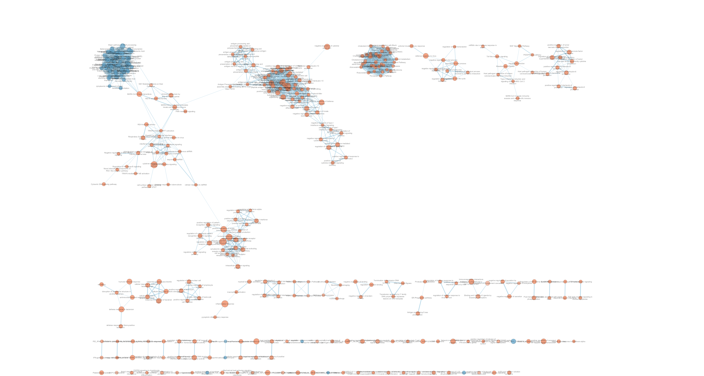
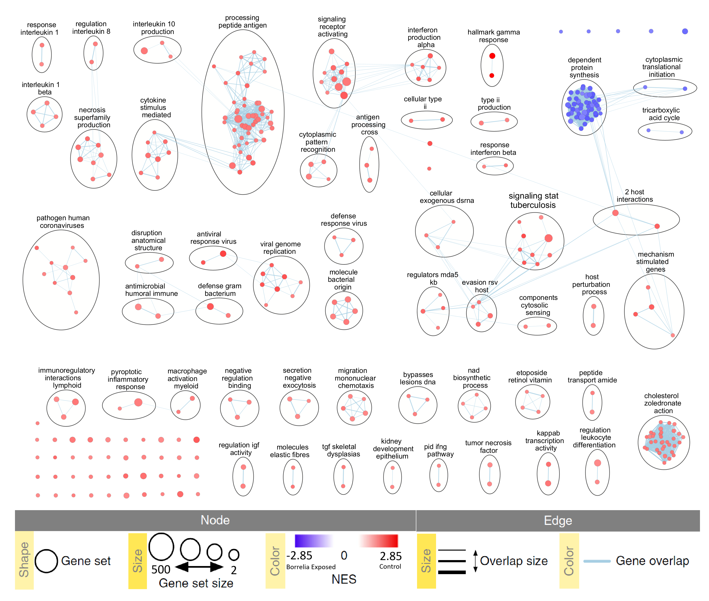
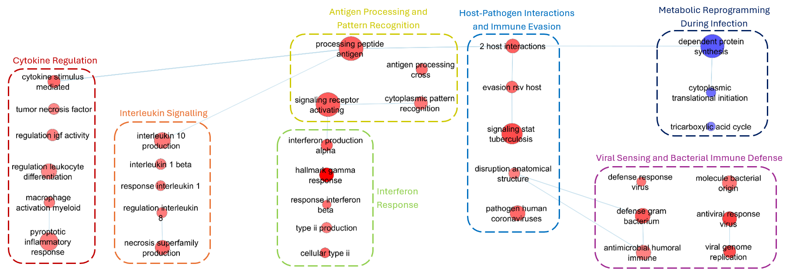
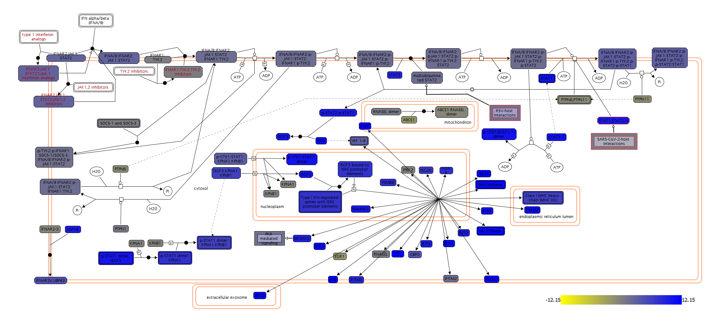

# Introduction
Previously in Assignment 1, the RNA-seq dataset with accession [GSE194294](https://www.ncbi.nlm.nih.gov/geo/query/acc.cgi?acc=GSE194294)[@berthold2024], referred to as the **Bb dataset** moving forward, was explored, pre-processed, and normalized in preparation for differential expression analysis which was performed in Assignment 2. Additionally, the dataset also underwent thresholded analysis via ORA where we observed significantly enriched pathways for the HUVEC cells particulary in cellular immune response. For this assignment, we will perform further analysis of the dataset using non-thresholded analysis through Gene Set Enrinchment Analysis (GSEA) and explore the enriched biological themes found in our dataset.

## Assignment 1 Recap
The Bb dataset examines how Borrelia burgdorferi infection affects gene expression and DNA methylation in human cells [@berthold2024]. It consists of 12 samples from two cell lines, HUVEC and HEK-293, exposed to *B. burgdorferi* strain B31 for 72 hours, with three replicates for each condition and control. The dataset initially contained 29,530 genes and 12 samples. After filtering lowly expressed genes, 16,620 genes were retained. This ensured that genes present in at least two samples per condition were kept, maintaining biological variability. The dataset was normalized using the TMM method in edgeR to account for library size differences, preserving biological variation. After normalization, the data showed improved distribution alignment across samples, with MDS and BCV plots confirming separation by treatment rather than cell type. Ensemble IDs were converted to HGNC symbols, with 99.25% of genes successfully mapped, leaving 16,497 genes for further analysis. The final normalized matrix consisted of 16,497 genes, with HUVEC samples having 1.2 million counts and HEK-293 samples having 800k counts.

## Assignment 2 Recap
We revisited the MDS plots created in Assignment 1 and decided that the cell lines should be analyzed separately due to the observed dominant effect of the treatment as compared to the cell line effect, which was exactly what the authors did in the original publication. After splitting by cell lines, we created our model designs and used the Quasi Likelihood (QL) Test to fit our model. Additionally, we adjusted for multiple hypothesis testing by using the Benjamini-Hochberg methods. From here, we were able to obtain the differentially expressed genes from our dataset, which we visualized as MA plots, volcano plots, and heatmaps. Then, we created four gene lists which will be used for ORA: upregulated, downregulated, combined, and fdr-corrected. In all of these gene sets, we set a threshold of p-value < 0.05 to establish statistical significance. Additionally, the upregulated gene set will have a log fold change > 1 while the downregulated set will have a log fold change < 1. The combined dataset is just a combination of the upregulated and downregulated gene sets while the fdr-corrected set will have a threshold of FDR < 0.05 to determine the most significant genes that survive multiple hypothesis testing. We performed ORA using g:profiler and then found annotations for the overrepresented genes. We found that for the HEK293 cells, there were no enriched annotations whereas HUVEC cells had several enriched pathways related to viral regulation, particularly among the downregulated genes. The top annotations, ordered by significance, include negative regulation of viral process, negative regulation of viral genome replication, regulation of viral process, regulation of viral genome replication, and regulation of viral life cycle.

Due to this finding in Assignment 2, we decided to only perform GSEA on the HUVEC cells to save time, although it would be preferable to also perform it for HEK293 since GSEA does not use cutoffs, meaning that we may find more subtle annotations in HEK293. 

# Load Libraries Used
In this report, 6 libraries were used for the different downstream analysis performed:

1. **Rcurl** [@duncan2024] to perform HTTP requests
2. **knitr** [@xie2014] to format tables in html
5. **RCy3** [@gustavsen2019] to use easy cyRest library to communicate with cytoscape
6. **httr** [@wickham2023] to be able to work with URLs locally
```{r}
library(RCurl)
library(knitr)
library(RCy3)
library(httr)
```


# Non-thresholded GSEA {#run-gsea}
In this section, we conduct a non-thresholded gene set enrichment analysis using the ranked genes from Assignment #2. By performing a non-thresholded analysis, we are avoiding arbitrary cutoffs such as when we set a significance threshold (FDR < 0.05, logFC > 1) for our ORA. In GSEA, we include all genes and rank them which reduces bias introduced by filtering and captures enrichment patterns across all genes which can reveal subtle but biologically meaningful signals [@subramanian2005].

## Create Ranked Gene List
Before performing GSEA, we obtain the genes used for the ORA analysis and we compute their rankings based on their differential expression. We use the formula `logPvalue*sign(logFoldChange)` to compute the rankings because it captures both statistical significance and direction of change in the gene expression.
```{r}
load("data/huvec_qlf_hgnc.RData")

# Compute Ranks
huvec_qlf_hgnc[, "rank"] <- log(huvec_qlf_hgnc$PValue, base=10) * sign(huvec_qlf_hgnc$logFC)

# Sort table by rank
huvec_qlf_hgnc <- huvec_qlf_hgnc[order(huvec_qlf_hgnc$rank), ]

# Subset to only include hgnc symbol and rank
rank_data <- huvec_qlf_hgnc[, c("hgnc_symbol", "rank")]

# write to a .rnk file 
write.table(rank_data, file = "data/ranked_gene_list.rnk", sep = "\t", 
            row.names = FALSE, col.names = FALSE, quote = FALSE)
```

**Table 1.** Ranked List of Genes for the Bb dataser. 
```{r}
kable(rbind(head(rank_data, 5), c("...", "..."), tail(rank_data, 5)), row.names = FALSE)
```

Table 1 shows the top 5 upregulated genes (bottom 5 of table) and top 5 downregulated (top 5 of table) genes from our ranked list. All other genes would be in between these genes, denoted as `...`. Note that this includes all of the identified 16497 genes. We save this table as `.rnk` file so it can be used by GSEA.

## Setting up GSEA
Aside for the ranked gene set, we also need to configure several variables that will be used in GSEA, as well as download the command line interface (CLI) that will enable us to run GSEA programmatically. For this analysis, we use GSEA version 4.4.0 [@subramanian2005], specifically `gsea-cli.sh` downloaded from
the [GSEA Software website](https://www.gsea-msigdb.org/gsea/downloads.jsp). This download did not have Java with it, so we had to download the latest version (Java 21) separately [(See journal for details)](https://github.com/bcb420-2025/Chloe_Calica/wiki/Entry-11%E2%80%9012.1:-Assignment-3#running-gsea). 

```{r}
# Path to the command line interface of GSEA
gsea_jar <- "GSEA_4.4.0/gsea-cli.sh"

# Directories to be accessed
working_dir<- "data"
output_dir <- "gseaOutput"

# Names to be used
analysis_name <- "ControlvsBbExposure"
dest_gmt_file <- ""
rnk_file <- "ranked_gene_list.rnk"

# TRUE if we need to run GSEA 
run_gsea <- FALSE
```

## Download the Latest Pathway Definition File
In order to obtain the biological context for the genes in our dataset, we must have a pathway definition file (usually in GMT format). This file contains the collection of genes that share some biological function or pathway and it is used by GSEA to identify the enriched pathways from our genes which will help us interprest its biological significance.

For this report, we use the most recent human geneset from the Bader Lab that contains only pathways and GO biological processes. The code is configured to grab the most recent release, which in this case is dated from March 2, 2025. Below is the filename of the GMT file that had been downloaded:
`Human_GOBP_AllPathways_noPFOCR_no_GO_iea_March_01_2025_symbol.gmt`
```{r}
if(dest_gmt_file == ""){
  gmt_url = "http://download.baderlab.org/EM_Genesets/current_release/Human/symbol/"
  
  #list all the files on the server
  filenames = getURL(gmt_url)
  tc = textConnection(filenames)
  contents = readLines(tc)
  close(tc)
  
  #get the gmt that has all the pathways and does not include terms 
  # inferred from electronic annotations(IEA)
  #start with gmt file that has pathways only and GO Biological Process only.
  rx = gregexpr("(?<=<a href=\")(.*.GOBP_AllPathways_noPFOCR_no_GO_iea.*.)(.gmt)(?=\">)",
    contents, perl = TRUE)
  gmt_file = unlist(regmatches(contents, rx))
  
  dest_gmt_file <- file.path(output_dir,gmt_file)
  
  #check if this gmt file already exists
  if(!file.exists(dest_gmt_file)){
    download.file(
      paste(gmt_url,gmt_file,sep=""),
      destfile=dest_gmt_file
    )
  }
}
```

## Run GSEA
Now that we have our ranked gene list and our pathway definition file, we can now run GSEA programmatically in this notebook by invoking R's `system()` command which allows us to execurte commands as if we were directly typing them in the terminal. In this case, we are executing the program defined by `gsea_jar` which as mentioned before is the command line interface for GSEA. In order to run it, we just supply the command with all the parameters needed to conduct GSEA, similar to how we set parameters using the Java GUI. Of note, we set the following parameters:

* `Number of permutations = 1000` which is the recommended number of permutations in the original GSEA publication [@subramanian2005].
* `Maximum geneset size = 200` to exclude larger sets which can usually dominate the results, masking the smaller, more specific pathways. By using this value, we ensure that we do not get broad, less informative sets and avoidant redundant sets that have overlaps in multiple pathways [@subramanian2005].
* `Minimum geneset size = 15` to exclude smaller sets which are more susceptible to random noise. A minimum of 15 ensures that there are enough genes in the set to generate a stable score while also ensuring that the pathways we get are meaningful and not fragmented i.e. partial/incomplete pathways [@subramanian2005].

The output is stored in the directory `gseaOutput/` and it consists of multiple `.png` and `.html` files which are compiled in `index.html` which we will explore in the following section to uncover the main results of our analysis.
```{r}
if (run_gsea){
  command <- paste("",gsea_jar,
                   "GSEAPreRanked -gmx", dest_gmt_file,
                   "-rnk" , file.path(working_dir, rnk_file),
                   "-collapse false -nperm 1000 -scoring_scheme weighted",
                   "-rpt_label ",analysis_name,
                   "-plot_top_x 20 -rnd_seed 12345  -set_max 200",
                   " -set_min 15 -zip_report false ",
                   " -out" ,output_dir,
                   " > gsea_output.txt",sep=" ")
  system(command)
}
```

## GSEA results {#gsea-results}
GSEA was performed on the Bb dataset containing 16497 genes, with 5552 gene sets passing the initial filtering criteria. The results revealed distinct differences between gene sets upregulated in *Borrelia* exposed samples and those upregulated in the control group. 

**Preview of the index.html file produced by the GSEA results.** For some reason, links to the actual results are broken, but links to outside resources work just fine. They can still be accessed through the actual `index.html` though, it is only this preview where the links do not work.
```{r, echo=FALSE, results='asis'}
cat('<iframe src="gseaOutput/ControlvsBbExposure/index.html" width="100%" height="500px"></iframe>')
```

### Upregulated in Control
For the na_pos phenotype, representing gene sets upregulated in the Control group, a total of 3,289 gene sets were found to be upregulated. Of these, 584 gene sets were significant at a False Discovery Rate (FDR) of less than 25%. Additionally, 374 gene sets were significantly enriched at a nominal p-value of less than 1%, and 632 gene sets were significantly enriched at a nominal p-value of less than 5%.  The top-ranking gene sets exhibited high Enrichment Scores (ES > 0.85) and Normalized Enrichment Scores (NES > 2.5), indicating strong and statistically significant enrichment.

The majority of these gene sets (Table 2) are involved in immune-related pathways, such as interferon response, defense response to viruses, and antiviral immune responses, which are generally downregulated during Borrelia infection. This suggests that Borrelia burgdorferi suppresses these immune responses during infection, leading to their upregulation in the Control group, where no infection is present. 

**Table 2. Top 10 enriched Gene Sets in the Control Group of the HUVEC Cells.**

|Gene Set|Source|Size|ES|NES|
|--------|------|----|--|---|
|Hallmark Interferon Gamma Response|MSigDB|142|	0.92|	2.93|
|Hallmark Interferon Alpha Response|MSigDB|81	|0.96	|2.86|
|Defense Response to Virus|GO:BP|155|	0.87|	2.81|
|Interferon Alpha Beta Signaling|Reactome|62|	0.94	|2.67|
|Regulation of Viral Process|GO:BP|109|	0.85|	2.64|
|Interferon Gamma Signaling|Reactome|77	|0.89	|2.63	|
|Regulation of Viral Life Cycle|GO:BP|88|	0.85	|2.59|
|Negative Regulation of Viral Process|GO:BP|57|	0.92	|2.58|
|Antiviral Innate Immune Response|GO:BP|56|	0.89|	2.53|
|Response to Type I Inteferon|GO:BP|35|	0.94	|2.51	|

These results suggest a robust activation of immune functions in control samples, highlighting a relative suppression of these pathways in the Borrelia-exposed group. While p-values were not explicitly reported for the top terms due to their extremely small values (displayed as 0.0), their significance is strongly supported by the NES and ES metrics. Further insights into the specific contributing genes can be obtained by examining the leading-edge subsets in the accompanying `.html` report.

**Preview of the .html file for the enriched gene sets in the control group.** Similar to `index.html`, links in this preview do not work, but they can be accessed in the author's git repo.
```{r, echo=FALSE, results='asis'}
cat('<iframe src="gseaOutput/ControlvsBbExposure/gsea_report_for_na_pos_1743724865498.html" width="100%" height="500px"></iframe>')
```

### Upregulated in Borrelia Exposed
In contrast, for the na_neg phenotype, representing gene sets upregulated in Borrelia-exposed samples, 2,263 gene sets were found to be upregulated. Of these, 133 gene sets were significant at an FDR of less than 25%, 137 gene sets were significantly enriched at a nominal p-value of less than 1%, and 326 gene sets were enriched at a nominal p-value of less than 5%. Notably, the top-ranking gene sets all displayed negative ES and NES, indicating that these pathways are more active in the Borrelia-exposed samples compared to controls.

**Table 3. Top 10 enriched Gene Sets in the Borrelia Exposed Group of HUVEC Cells.**

|Gene Set|Source|Size|ES|NES|
|--------|------|----|--|---|
|Eukaryotic Translation Initiation | Reactome|116	|-0.66|	-2.48|
|Cap-dependent Translation Initiation | Reactome|116|	-0.66|	-2.46|
|L13A-Mediated Translational Silencing of Ceruloplasmin Expression | Reactome|108|	-0.66|	-2.45	|
|GTP Hydrolysis and Joining of the 60S Ribosomal Subunit | Reactome|109|	-0.66|	-2.43	|
|Formation of a Pool of Free 40S Subunits| Reactome|98|	-0.66|-2.41|
|Protein Synthesis: Phenylalanine|PathWhiz |80|	-0.66	|-2.36|
|Peptide Chain Elongation| Reactome|86|	-0.65|	-2.36|
|Selenocysteine Synthesis | Reactome|90|	-0.64	|-2.36|	
|Protein Synthesis: Glycine|PathWhiz |79	|-0.66	|-2.35|	
|Protein Synthesis: Threonine|PathWhiz |79	|-0.66	|-2.34|	

Interestingly, the top enriched pathways in this group were predominantly related to protein synthesis and translation, including eukaryotic translation initiation, peptide chain elongation, and ribosomal subunit assembly. This pattern suggests that Borrelia exposure leads to an upregulation of the host's translational machinery, potentially reflecting increased metabolic or stress-related protein production in response to infection. These findings contrast with the immune suppression seen in control-enriched gene sets and may indicate a cellular shift toward protein biosynthesis during active infection.

**Preview of the .html file for the enriched gene sets in the Borrelia exposed group.** Similar to `index.html`, links in this preview do not work, but they can be accessed in the author's git repo.
```{r, echo=FALSE, results='asis'}
cat('<iframe src="gseaOutput/ControlvsBbExposure/gsea_report_for_na_neg_1743724865498.html" width="100%" height="500px"></iframe>')
```

## Comparsion to thresholded ORA {#ora-comparison}
When comparing the results from the gene set enrichment analysis (GSEA) to the over-representation analysis (ORA) conducted in Assignment #2, there is a strong qualitative agreement between the two approaches, particularly for the upregulated genes in the control group. The top enriched gene sets from the ORA included terms such as Negative Regulation of Viral Process, Interferon Alpha/Beta Signaling, and Antiviral Mechanism by IFN-stimulated Genes. These are functionally aligned with the leading gene sets identified by GSEA in the na_pos phenotype, even having the same source identifier which means that they intersect very well. Both methods consistently highlight immune-related pathways, particularly antiviral and interferon-mediated responses as being more active in the control samples compared to Borrelia-exposed samples.

**Table 4. Top Enriched Pathways Identified by ORA in the HUVEC Adjusted Gene Set**

|Enriched Term                                      |      Pvalue| Intersection Size| Source |
|:-----------------------------------------------|------------:|-----------------:|:------|
|negative regulation of viral process            | 8.721804e-23|                17|GO:BP  |
|negative regulation of viral genome replication | 1.099912e-20|                14|GO:BP  |
|regulation of viral process                     | 4.995598e-20|                18|GO:BP  |
|regulation of viral genome replication          | 3.452715e-18|                14|GO:BP  |
|regulation of viral life cycle                  | 5.694054e-18|                16|GO:BP  |
|Interferon alpha/beta signaling                 | 1.800000e-39|                25|REAC   |
|Antiviral mechanism by IFN-stimulated genes     | 2.451854e-13|                14|REAC   |
|Interferon gamma signaling                      | 1.724141e-11|                11|REAC   |
|ISG15 antiviral mechanism                       | 3.985795e-11|                10|REAC   |
|OAS antiviral response                          | 9.755497e-09|                 5|REAC   |

While the two methods differ in analytical approach, ORA requiring pre-selection of differentially expressed genes based on arbitrary thresholds, and GSEA evaluating enrichment patterns across the full ranked gene list—they both point to the same biological conclusion: a downregulation of antiviral immune pathways in Borrelia-exposed samples, suggesting potential immune suppression. Since the terms were very similar, this comparison was perfectly straightforward. The convergence of findings across both methods strengthens the validity of the observed immune-related signals.

# Visualization of GSEA in Cytoscape
In the following section, we will create an enrichment map in order to visualize the GSEA results.

## Setting Up Cytoscape {#run-cytoscape}
We first configure various parameters that we will need when running Cytoscape programmatically. These parameters include whether we are running RStudio from a docker instance, the directories and files we need to access, and the thresholds we need to create the enrichment map. Specifically, we will be using the following thresholds: 

* a p-value cutoff of 1.0 to include all tested gene sets regardless of nominal significance [@reimand2019], 
* a q-value (FDR) threshold of 0.05 to retain only those gene sets that are statistically significant after multiple testing correction [@reimand2019], and 
* a similarity cutoff of 0.375 to filter the edges and ensure meaningful connections between functionally similar pathways [@reimand2019]. 

These thresholds are commonly used in enrichment map analyses to balance network complexity with biological interpretability, allowing the retention of high-confidence, biologically relevant gene sets while minimizing noise.
```{r}
# is_docker - true/false depending on if you are running R from docker
is_docker <- TRUE

# Directories to be accessed
working_dir<- "data"
output_dir <- "gseaOutput"

# Defined threshold for GSEA enrichments 
# p-value to filter all the genesets.
pvalue_gsea_threshold <- "1.0"

# q-value to filter all the genesets.
qvalue_gsea_threshold <- "0.05"

# Similarity threshold to filter all the genesets connections/edges.  
similarity_threshold <- "0.375"

# Similarity metric to filter all the genesets connections/edges 
# (can be OVERLAP, JACCARD, or COMBINED.  
similarity_metric <- "COMBINED"

# File Specifications
gmt_gsea_file <-"gseaOutput/Human_GOBP_AllPathways_noPFOCR_no_GO_iea_March_01_2025_symbol.gmt"
gsea_results_filename <- "gseaOutput/ControlvsBbExposure/edb/results.edb"

# Optional for enrichment map
# gsea_ranks_file
# expression_file_fullpath
# cls_file_fullpath
```

## Run Cytoscape
To visualize and interpret the results of our gene set enrichment analysis, we utilized Cytoscape programmatically through the RCy3 package.

* Here, we specify the URLs for the local web server then we use the command `cytoscapePing` to check if Cytoscape is running and accessible from our R session.
```{r, eval=FALSE}
if(is_docker){
  current_base = "host.docker.internal:1234/v1"
  .defaultBaseUrl <- "http://host.docker.internal:1234/v1"
} else{
  current_base = "localhost:1234/v1"
}

cytoscapePing (base.url = current_base)
```
* Then, we upload datafiles to Cytoscape.
```{r, eval=FALSE}
#if using docker we need to replace all the the paths to the host path
if(is_docker) {
  upload_em_file <- function(localPath) {
    bname <- basename(localPath)
    r <- POST(
      url = 
paste('http://host.docker.internal:1234/enrichmentmap/textfileupload?fileName=', 
                  bname, sep=""),
      config = list(),
      body = list(file = upload_file(localPath)),
      encode = "multipart",
      handle = NULL
    )
    content(r,"parsed")$path
  }
  
  # "upload" the files to the host machine and replace each path 
  # with the host machine path
  
  # gsea_ranks_file <- upload_em_file(gsea_ranks_file)
  # expression_file_fullpath <- upload_em_file(expression_file_fullpath)
  # class_file_fullpath <- upload_em_file(cls_file_fullpath)
  
  gmt_gsea_file <- upload_em_file(gmt_gsea_file)
  gsea_results_filename <- upload_em_file(gsea_results_filename)
}
```

* Finally, we create an Enrichment Map by running the EM command
```{r, eval=FALSE}
#create EM
cur_model_name <- "ControlvsBbExposure"

current_network_name <- paste(cur_model_name,pvalue_gsea_threshold,
                              qvalue_gsea_threshold,sep="_")

em_command = paste('enrichmentmap build analysisType="gsea" gmtFile=',
                                                              gmt_gsea_file,
                   'pvalue=',pvalue_gsea_threshold, 
                   'qvalue=',qvalue_gsea_threshold,
                   'similaritycutoff=',similarity_threshold,
                   'coefficients=',similarity_metric,
                   # 'ranksDataset1=', gsea_ranks_file,
                   'enrichmentsDataset1=',gsea_results_filename, 
                   'filterByExpressions=false',
                   # 'expressionDataset1=',expression_file_fullpath,
                   # 'classDataset1=',class_file_fullpath,
                   'gmtFile=',gmt_gsea_file,
                   sep=" ")

#enrichment map command will return the suid of newly created network.
response <- commandsGET(em_command,base.url = current_base)

current_network_suid <- 0
#enrichment map command will return the suid of newly created network 
# unless it Failed.  If it failed it will contain the word failed
if(grepl(pattern="Failed", response)){
  paste(response)
} else {
  current_network_suid <- response
}

#check to see if the network name is unique
current_names <- getNetworkList(base.url = current_base)
if(current_network_name %in% current_names){
  #if the name already exists in the network names then put the SUID in front
  # of the name (this does not work if you put the suid at the end of the name)
  current_network_name <- paste(current_network_suid,
                                current_network_name,sep="_")
}
response <- renameNetwork(title=current_network_name, 
                       network = as.numeric(current_network_suid),
                       base.url = current_base)
```

The resulting enrichment map consisted of 354 nodes (representing enriched gene sets) and 2,467 edges (representing their functional similarities), offering a network-based view of the enriched biological themes. Since we are running our RStudio instance using docker, we can not save the networks programmatically so they were saved manually through the Cytoscape software.


**Figure 1. Initial Cytoscape Enrichment Map of GSEA Results for Control vs Borrelia Exposure Groups.** Parameters used to generate the network included a nominal p-value cutoff of 1.0, a false discovery rate (q-value) threshold of 0.05, and a similarity cutoff of 0.375 for connecting related gene sets. 

## Network Annotation {#network-annotation}
When we downloaded the EnrichmentMap Pipeline Collection (v1.1.0) [@reimand2019], it included three other applications that automatically annotated the map for us. These applications are as follows and below them were the default parameters used to generate the enrichment map created:

* AutoAnnotate (v1.5.2) [@reimand2019] to finds clusters and visually annotate them with labels and groups.
  * Normalization Factor: 0.5
  * Attribute Name: Gene Set Description
  * Display Style: Clustered-Standard
  * Max Words Per Cloud: 250
  * ClusterCutoff: 1.0
* clusterMaker2 (v2.3.4) [@morris2011] to cluster the nodes within a network.
  * ClusterMaker Algorithm: MCL Cluster
  * Edge Attribute: Similarity Coefficient
* WordCloud (v3.1.4) [@oesper2011] to generate a "word tag cloud" that summarizes the annotations within a cluster.
  * Max Words Per Label: 3
  * Minimum Word Occurrence: 1
  * Word Adjacency Bonus: 8

### Publication Ready Figure {#pub-ready}
In order to create an organized and clearer picture of the enrichment map, similar pathways were manually laid out next to one another e.g. the top left clusters in Figure 2 are all related to interleukins. No cluster was omitted in the figure so all these nodes represent all the enriched pathways found through GSEA. however, individual node lables were removed for clarity using the publication-ready button in Enrichment map to prevent cluttring of labels. Additionally, the legend below the figure was directly adapted from the original publication of the protocol for using enrichment maps [@reimand2019], but edited to best reflect the data we had i.e. Gene set size and NES values were changed appropriately.


**Figure 2. Resulting publication-ready enrichment map of the GSEA results for Control Vs Borrelia Exposed Groups.** Overall view of the enrichment map created with parameters FDR q Q value < 0.01, combined coefficient >0.375, and combined constant = 0.5 Red and blue nodes represent the control and Borrelia exposed phenotype pathways, respectively. 

### Collapsed Theme Network {#collapsed}
As mentioned previously, the clusters were already laid out in Figure 2 so that similar ones were grouped together. However, in order to better observe the the major themes present in the enrichment map, the network is further collapsed. The AutoAnnotate Application has the option to summarize the network by collapsing the node clusters and so, this was used in our enrichment map. Figure 3 below shows the collapsed theme network which was further annotated manually using "super-clusters." Since we observe many similar clusters in Figure 2, creating these super-clusters help us see what the major ones are. In this figure though, nodes that did not group well with other clusters were omitted for simplicity.


**Figure 3. Collapsed enrichment map of the GSEA results for Control Vs Borrelia Exposed Groups.** Each cluster of nodes in Fig. 10 is now represented a single node. The networks was scaled for better node distribution and manually adjusted so similar nodes cluster together and can be grouped into a "super-cluster." Only major themes are present in this figure while smaller nodes that did not group well were omitted but can still be viewed in Figure X.

#### Major Biological Themes
From Figure 3, the enrichment map revealed distinct biological themes between the Control and Borrelia-exposed phenotypes, aligning with expected host-pathogen dynamics. For the Control phenotype, the dominant themes include cytokine regulation, interleukin signaling, antigen processing / pattern recognition, interferon response, host-pathogen interactions / immune evasion, and viral sensing / bacterial immune defense. All of which suggest a robust, well-orchestrated immune surveillance state. These pathways reflect immune readiness and the capacity to detect and respond to microbial threats through innate and adaptive mechanisms. 

In contrast, the Borrelia-exposed group exhibited fewer enriched nodes, clustering primarily around a single theme: metabolic reprogramming during infection. This suggests that Borrelia burgdorferi exposure may suppress or evade typical immune responses while driving host cells to redirect their metabolic processes to accommodate infection or pathogen survival. The contrast between diverse immune activation in controls and restricted metabolic adaptation in exposed samples reflects how Borrelia may avoid immune detection and modulate host environments to persist.

#### Novel Themes
Several novel and intriguing pathways emerged in the enrichment map that provide insight into the host endothelial response to *Borrelia burgdorferi* (Recall that these treatments were performed on HUVEC cells or Human Umbilical Vein Endothelial Cells). Terms such as "evasion RSV host" and "pathogen human coronaviruses", while originally associated with viral infections, point to shared innate immune evasion strategies that Borrelia may exploit, particularly in dampening interferon responses or avoiding cytosolic pattern recognition receptors. The enrichment of "components cytosolic sensing" and "regulators MDA5 kb" further supports the idea that intracellular nucleic acid sensing pathways are activated or manipulated during Borrelia infection, despite it being a bacterium, indicating possible mimicry or indirect activation of antiviral-like pathways. Additionally, "disruption of anatomical structure" reflects endothelial barrier compromise, a hallmark of vascular inflammation and permeability changes often seen in disseminated Lyme disease. Together, these enriched pathways reveal that *Borrelia burgdorferi* not only induces classical inflammatory and cytokine responses but may also trigger atypical or underappreciated host defense programs, possibly contributing to its persistence and vascular tropism.

# Interpretation
In this section, major themes discovered in the enrichment map are compared to the orignal authors' findings. Additionally, further evidence in the form of related publications are mentioned where significant terms have been discovered.

## GSEA Results Support Original Conslusions {#interpret-comparison}
The enrichment results strongly support the conclusions and mechanisms discussed in the original paper. Both the thresholded analysis in Assignment 2 and the enrichment map generated using GSEA and Cytoscape highlight downregulation of antiviral and interferon-related pathways in Borrelia burgdorferi-exposed HUVEC cells. These include canonical immune response processes such as Interferon alpha/beta signaling, Antiviral mechanisms by IFN-stimulated genes, OAS antiviral response, and ISG15 antiviral pathway. The consistency between our results and the original findings, particularly the presence of interferon-stimulated genes strengthens the conclusion that Borrelia may actively suppress host antiviral responses as part of its immune evasion strategy [@berthold2024]. Furthermore, the identification of terms like “evasion RSV host” and “pathogen human coronaviruses” in the enrichment map, while not explicitly discussed in the original paper, aligns conceptually with the idea that Borrelia employs mechanisms typically seen in viral pathogens to avoid host immune detection.

Compared to the thresholded overrepresentation analysis (ORA) in Assignment 2, the enrichment map from GSEA provided a more holistic and nuanced view of pathway activation patterns. While the ORA results were highly similar in terms of identifying immune-related pathways in the Control phenotype (e.g., negative regulation of viral processes, interferon signaling), the GSEA method captured rank-based enrichment across the entire expression dataset, which allowed the detection of broader or subtler trends that may have been missed due to arbitrary cutoffs in the thresholded approach. For example, the GSEA enrichment map revealed novel themes such as cytosolic sensing of nucleic acids, host-pathogen interaction pathways, and disruption of endothelial structure, which provide additional insight into the vascular and immune dimensions of the HUVEC response to Borrelia.

However, this comparison is not entirely straightforward. ORA is limited to a subset of significantly differentially expressed genes, while GSEA evaluates entire gene sets ranked by expression, allowing for the detection of coordinated shifts that don’t necessarily meet fold change or p-value cutoffs. As a result, the GSEA results offer richer biological context and support additional mechanisms, such as metabolic reprogramming in the Borrelia-exposed group, that were not evident in the thresholded analysis.

## Further Evidence in Publications {#further-evidence}
The following subsections provide a comprehensive comparison of our GSEA results with findings from other publications that also looked at *Borrelia* exposure.

### Endothelial Cells Exposed to Borrelia burgdorferi

Major themes found in the Control phenotypealign with prior research demonstrating that B. burgdorferi exposure induces a robust pro-inflammatory response in endothelial cells. For instance, a study by Bastounis et al. [@bastounis2022] observed upregulation of pathways such as NFκB signaling, TNF signaling, and IL-17 signaling in endothelial cells at 4 hours post-exposure to B. burgdorferi, indicating an early innate immune response. Additionally, Dame et al. [@dame2007] reported that B. burgdorferi and IFN-γ synergistically enhance immune signaling in endothelial cells, particularly through the upregulation of chemokines which are involved in T-cell recruitment and chronic inflammation. While our GSEA approach did not focus on individual genes, we observed enrichment in gene sets related to cytokine signaling, interleukin pathways, and interferon responses. These enriched pathways align with the broader immune processes highlighted by Dame et al. [@dame2007], supporting the idea that B. burgdorferi exposure triggers a pro-inflammatory program in endothelial cells that may contribute to chronic immune activation.

### Fibroblasts and Monocytes Exposed to Borrelia burgdorferi

The enrichment of interferon-related pathways in the Borrelia-exposed phenotype is consistent with previous findings in other cell types. Meddeb et al. [@meddeb2016] demonstrated that fibroblasts exposed to B. burgdorferi upregulate type I interferon response genes, while Salazar et al. [@salazar2009] observed a similar activation of interferon-stimulated genes (ISGs) in monocytes. Our GSEA results revealed robust enrichment in gene sets related to interferon response, creating many clusters as observed in Figure 3. These results suggest that the activation of interferon signaling is a conserved and central aspect of the host response to B. burgdorferi across multiple cell types, including endothelial cells.

### Evidence for Novel Themes
Beyond the corroborated pathways, your GSEA results highlighted novel themes such as metabolic reprogramming during infection. This aligns with recent studies suggesting that B. burgdorferi infection can alter host cell metabolism to favor bacterial survival and persistence [@hu2023]. For instance, research has shown that endothelial cells undergo metabolic changes upon B. burgdorferi exposure, which may contribute to the pathogen's ability to evade immune responses and establish chronic infection [@hu2023].

Additionally, the enrichment of pathways related to cytosolic sensing of nucleic acids and disruption of anatomical structure provides insight into the mechanisms by which B. burgdorferi interacts with host cells. The activation of cytosolic nucleic acid sensors may indicate that the bacterium's genetic material is recognized by the host's innate immune system, leading to downstream inflammatory responses [@hyde2022]. Furthermore, the disruption of endothelial barriers is a known consequence of B. burgdorferi infection, facilitating its dissemination through the vasculature [@kim2005].

## Interferon Response in More Detail {#specific-pathway}
In this following section, we investigate a specific enriched pathway from the GSEA results, specifically the Alpha-Beta Interferon Signaling Pathway (Reactome pathway ID: R-HSA-909733). Interferon signaling is a key component of the immune response to viral and bacterial infections, and *Borrelia burgdorferi* has been shown to interact with the host immune system in complex ways. Interferon alpha and beta signaling (Type I IFN) are critical for the early immune defense response, particularly in endothelial cells, where Borrelia burgdorferi infection can result in dysregulation of the immune response and contribute to chronic inflammation and disease persistence.

In the context of Borrelia burgdorferi infection, it is important to understand how the immune response, particularly through interferon signaling, is affected by bacterial exposure. By investigating how this pathway is enriched in my dataset, I can provide insight into the immune mechanisms triggered by Borrelia in endothelial cells and how these mechanisms may contribute to the persistence of infection or immune evasion.


**Figure X. Alpha-Beta Interferon Signaling Pathway Overlaid with Enriched Genes HUVEC Model.** Genes that were found in the model are overlaid with their rank score which was used in the GSEA analysis. With yellow being upregulated in Borrelia Exposure phenotype and blue upregulated in the Control.

In total, 76 genes were found to be enriched in this pathway which suggests that interferon signaling is significantly affected by Borrelia exposure in our model, and understanding how these genes are regulated (upregulated or downregulated) could give important clues into the immune mechanisms triggered during the infection. Most genes had a positive rank score, meaning that they were upregulated in the Control suggesting that these genes are likely part of an immune activation response. This aligns with the idea that interferon signaling is being induced as part of the host's defense mechanism against the pathogen. Also notice that most genes are colored dark blue meaning they were near the end of the scale, indicating strong upregulation in response to the infection. Thus, these genes play a key role in activating the immune response and interferon signaling pathways.

# Conclusion
The GSEA analysis identified several enriched pathways and gene sets in response to B. burgdorferi exposure. Notably, immune response pathways, including those related to interferon signaling, were prominently enriched, consistent with the known inflammatory effects of the bacterium. Additionally, the analysis highlighted novel themes such as metabolic reprogramming and cytosolic nucleic acid sensing, suggesting potential mechanisms through which B. burgdorferi interacts with host cells to evade immune responses and establish chronic infection. These findings align with previous studies and provide new insights into the cellular processes influenced by B. burgdorferi, which may contribute to the persistence of infection and the development of Lyme disease.

# Assignment Questions

## Non-thresholded GSEA
1. [What method did you use? What genesets did you use? Make sure to specify versions and cite your methods.](#run-gsea)
2. [Summarize your enrichment results.](#gsea-results)
3. [How do these results compare to the results from the thresholded analysis in Assignment #2. Compare qualitatively. Is this a straight forward comparison? Why or why not?](#ora-comparison)


## Visualization of GSEA in Cytoscape
1. [Create an enrichment map - how many nodes and how many edges in the resulting map? What thresholds were used to create this map? Make sure to record all thresholds. Include a screenshot of your network prior to manual layout.](#run-cytoscape)
2. [Annotate your network - what parameters did you use to annotate the network. If you are using the default parameters make sure to list them as well.](#network-annotation)
3. [Make a publication ready figure - include this figure with proper legends in your notebook.](#pub-ready)
4. [Collapse your network to a theme network. What are the major themes present in this analysis? Do they fit with the model? Are there any novel pathways or themes?](#collapsed)

## Interpretation
1. [Do the enrichment results support conclusions or mechanism discussed in the original paper? How do these results differ from the results you got from Assignment #2 thresholded methods](#interpret-comparison)
2. [Can you find evidence, i.e. publications, to support some of the results that you see. How does this evidence support your result?](#further-evidence)
3. [Choose a specific pathway or theme to investigate in more detail. Why did you choose this pathway or theme? Show the pathway or theme as a gene network or as a pathway diagram. Annotate the network or pathway with your original log fold expression values and p-values to show how it is effected in your model.](#specific-pathway)


# References